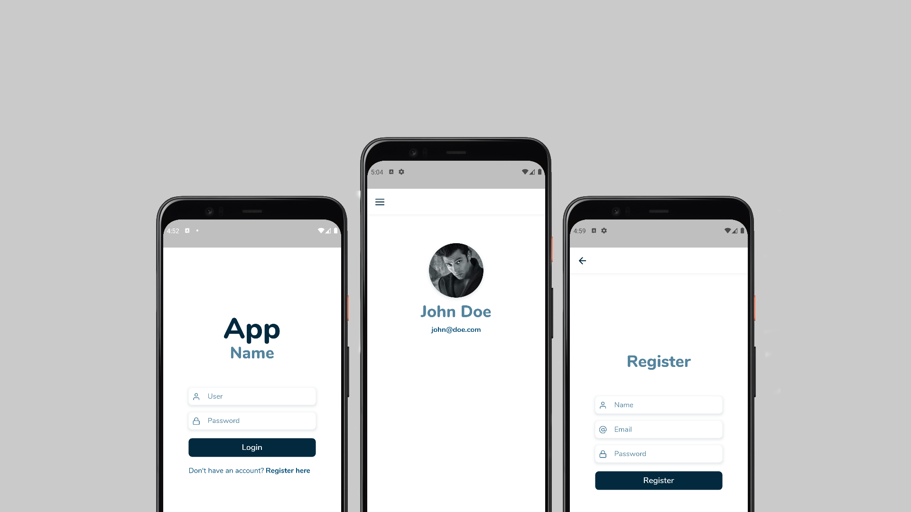

<h1 align="center">
  
</h1>

<br>

## 🧪 Tecnologias

Esse projeto foi desenvolvido com as seguintes tecnologias:

- [Flutter](https://flutter.dev/)

## 🚀 Como executar

Clone o projeto e acesse a pasta do mesmo.

```bash
$ git clone https://github.com/FelipeNS/flutter-login.git
$ cd flutter-login
```

Para iniciá-lo, siga os passos abaixo:
```bash
# Instalar as dependências
$ flutter pub get

# Iniciar o projeto
$ flutter run lib/main.dart
```

Lembrando que será necessário utilizar a [API feita em Node](https://github.com/FelipeNS/node-login) para que o app funcione como o esperado.

## 💻 Projeto

Um app básico feito para aprendizado de alguns fundamentos de flutter e dart consumindo uma API REST.

---

Feito com 💜 by Felipe Novais